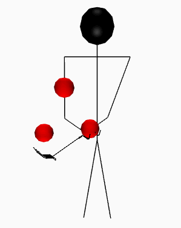

<h1 align="center">Gunswap</h1>

> An interactive web-based juggling simulator with many settings, camera controls and pattern savings. Project page: [gunswap.co](http://gunswap.co). Example gifs: [here](http://imgur.com/a/3QcTQ).

<p align="center">
  
</p>


# Table of contents

- [How to use](#how-to-use)
- [Development](#development)
    - [Testing](#testing)
- [License](#license)


# How to use

_todo_


# Development

Clone your fork with ```git clone```. Then:

```bash
npm install  # install dependencies
mongod  # start your mongo daemon (if not working try: sudo mongod)
node server.js  # start the app
```

On Windows: take a look at the `startDev.bat` script.


## Testing

_todo_

This uses [Mocha](https://github.com/mochajs/mocha) as a test automation framework

```bash
grunt simplemocha
```

# License

__MIT__. See [LICENSE.txt](LICENSE.txt)
