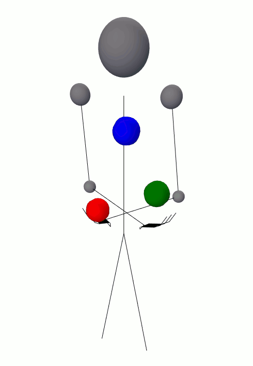

<h1 align="center">Gunswap — Juggling Animator</h1>

> An interactive web-based juggling simulator with many settings, camera controls and pattern savings. Project page: [gunswap.co](http://gunswap.co). Example gifs: [here](http://imgur.com/a/3QcTQ).

<p align="center">
  
</p>


# Table of contents

- [Features](#features)
- [How to use](#how-to-use)
- [Development](#development)
    - [Testing](#testing)
- [Software Credits](#software-credits)
- [License](#license)


# Features


- Animate juggling patterns using standard vanilla, multiplex and synchronous siteswap - notation.
- View patterns from sky camera or first person view. Rotate/zoom camera using mouse.
- Props include balls, clubs and rings. Change colors, size and bounciness.
- Customizable hand movement to support patterns like mills mess and factory.
- Passing with ability to define each juggler's position and rotation.
- Hand animation with modifiers for claw and penguin.
- Bounce juggling with multiple bounces, custom surfaces and multiple surfaces.
- Dwell duration modifier to stagger tosses for more realistic patterns.
- Spin modifier to allow for flats, doubles, etc.
- GIF export.
- Siteswap generator with support for multiplex and synchronous.
- Signup/login for ability to save patterns.


# How to use

_todo_


# Development

Clone your fork with ```git clone```. Then:

```bash
npm install  # install dependencies
mongod  # start your mongo daemon (if not working try: sudo mongod)
node server.js  # start the app
```

On Windows: take a look at the `startDev.bat` script.


## Testing

_todo_

Using [Mocha](https://github.com/mochajs/mocha) as a test automation framework

```bash
grunt simplemocha
```

# Software Credits

Front-end:

- [Three.js](http://threejs.org/) - 3D graphics
- [CCapture.js](https://github.com/spite/ccapture.js) - GIF generation
- [Bootstrap](http://getbootstrap.com/) - styling</li>
- [jQuery](https://jquery.com/) - misc. JS tasks
- [yamljs](https://www.npmjs.com/package/yamljs) - YAML parsing

Back-end:

- [Node.js](https://nodejs.org/en/)
- [MongoDB](https://www.mongodb.com/) - database
- [Mongoose](http://mongoosejs.com/) - Mongo object modeling
- [Express](https://expressjs.com/) - Node web framework
- [Passport](http://passportjs.org/) - authentication
- [And more...](https://github.com/yDgunz/gunswap/blob/master/package.json)

Misc. tools:

- [Heroku](http://www.heroku.com) - application hosting
- [mLab](https://mlab.com/) - MongoDB hosting
- [GitHub](http://www.github.com) - source code hosting
- [Grunt](http://gruntjs.com/) - build tasks
- [Mocha](https://mochajs.org/) - writing tests
- [Travis CI](https://travis-ci.org/yDgunz/gunswap) - running tests


# License

__MIT__. See [LICENSE.txt](LICENSE.txt)
